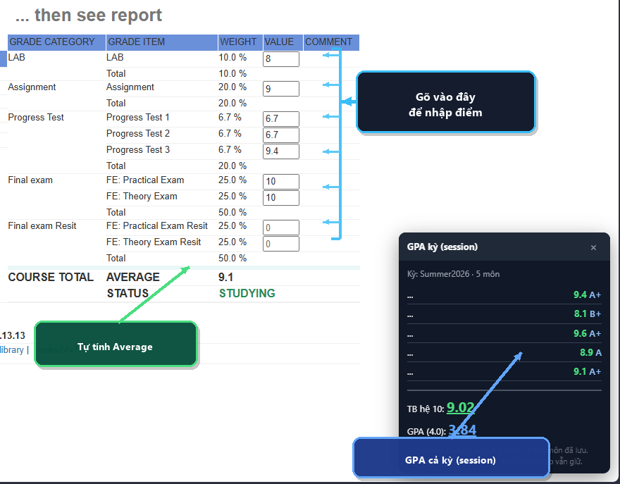

# FAP Grade Calculator

[](LICENSE)
[](https://vlantoy.github.io/fap-grade-calculator/)
[](https://fap.fpt.edu.vn/)

<p align="center">
  
</p>

Client-side tools for **FPT University Academic Portal (FAP)** students: estimate course averages from grade components (weight × value), handle resit overrides, and optionally aggregate a term GPA — without writing anything back to FAP.

**Homepage (script viewer + install):**  
https://vlantoy.github.io/fap-grade-calculator/

<p align="center">
  
</p>
<p align="center"><em>Demo on FAP Mark Report — weighted Average + session GPA panel</em></p>

> Not affiliated with FPT University. For personal what-if estimation only. Official grades always come from FAP.

---

## Features

| Feature | Userscript (full) | Console MVP |
|--------|-------------------|-------------|
| Editable **Value** cells on `StudentGrade` | Yes | Yes |
| Weighted average → **Average** row | Yes | Yes |
| **Resit** replaces 1st attempt of same component | Yes | Yes |
| Session store + **term GPA** panel | Yes | No |
| **Auto-reset** after idle TTL (default **3 min**) | Yes | Yes |
| No install (paste in DevTools) | — | Yes |

After the TTL (or closing the GPA panel with **×**), inputs are removed, Average/original cells are restored, and session data is cleared — as if the tool never ran. Typing again extends the TTL.

### Formula

```text
Average = Σ (valueᵢ × weightᵢ / 100)
```

- Empty value counts as `0` for first-attempt rows.
- If a **Resit** field has a value (including `0`), the matching first attempt is **excluded**.
- Term GPA (userscript): arithmetic mean of saved course averages (scale 10) and mean of FPT 4.0 grade points.

---

## Quick start

### A. Tampermonkey (recommended)

1. Install [Tampermonkey](https://www.tampermonkey.net/).
2. **Disable** other FAP scripts that full-screen alert on grade changes (e.g. “FAP Grade Watcher”) while testing.
3. Install the script:
   - From the [homepage](https://vlantoy.github.io/fap-grade-calculator/), or  
   - Open raw:  
     [`scripts/fap-grade-calculator.user.js`](https://raw.githubusercontent.com/Vlantoy/fap-grade-calculator/main/scripts/fap-grade-calculator.user.js)
4. Open [Mark Report](https://fap.fpt.edu.vn/Grade/StudentGrade.aspx) → pick a course → type values.

### B. Console MVP (one course, no extension)

1. Open a **single course** grade page (`StudentGrade.aspx?...&course=...`).
2. DevTools → **Console**.
3. Paste [`scripts/fap-grade-mvp-console.js`](scripts/fap-grade-mvp-console.js) and press Enter.  
   Or one-liner (online):

```js
fetch('https://raw.githubusercontent.com/Vlantoy/fap-grade-calculator/main/scripts/fap-grade-mvp-console.js')
  .then((r) => r.text())
  .then(eval);
```

4. Edit Value inputs → Average updates. Refresh clears everything.

---

## Repository layout

```text
fap-grade-calculator/
├── index.html                          # Landing page (shows scripts live)
├── assets/
│   ├── demo-screenshot.png             # Illustration / OG image
│   ├── favicon.svg                     # Browser tab icon (calculator)
│   ├── favicon.ico
│   └── favicon-*.png
├── scripts/
│   ├── fap-grade-calculator.user.js    # Full Tampermonkey userscript
│   └── fap-grade-mvp-console.js        # Console MVP (one course)
├── LICENSE
└── README.md
```

---

## How it works

1. Locates `#ctl00_mainContent_divGrade` / `table[summary="Report"]`.
2. Finds cells matching weights like `15.0 %`; the next cell is **Value**.
3. Injects plain `<input>` (no page CSS theme rewrite).
4. Writes the computed total into the **Average** cell (often `0.0` while studying).
5. Full userscript also writes course averages into `sessionStorage` and shows a small GPA panel on grade pages in the same browser tab.

---

## Privacy & safety

- Runs **only in your browser** on `fap.fpt.edu.vn`.
- No analytics, no backend, no grade upload.
- Session GPA uses `sessionStorage` (cleared when the tab/browser session ends).
- Do not paste cookies or credentials into issues.

---

## Compatibility

- Browser: Chromium (Chrome/Edge) or Firefox + Tampermonkey  
- Site: `https://fap.fpt.edu.vn/Grade/*`  
- Grade table: ASP.NET Mark Report (`divGrade` + `summary="Report"`)

---

## Development

```bash
git clone https://github.com/Vlantoy/fap-grade-calculator.git
cd fap-grade-calculator
# open index.html locally, or use any static server
npx --yes serve .
```

GitHub Pages serves the `main` branch root (`index.html`).

---

## License

[MIT](LICENSE) © Vlantoy

---

## Disclaimer

This project is unofficial. It does not modify FAP server data. Use at your own risk for study planning only.
